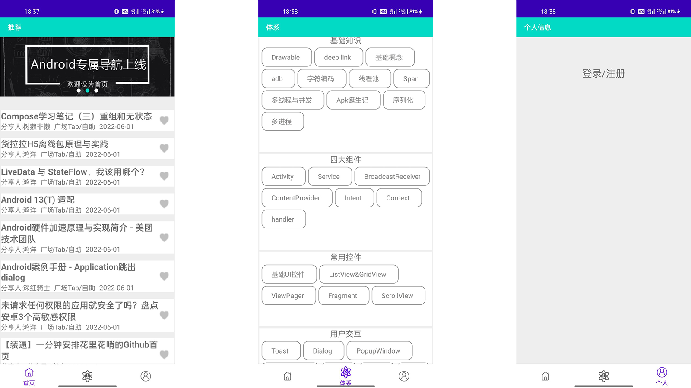
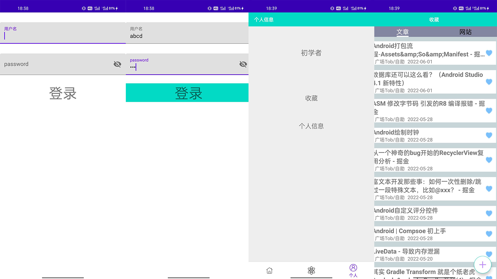
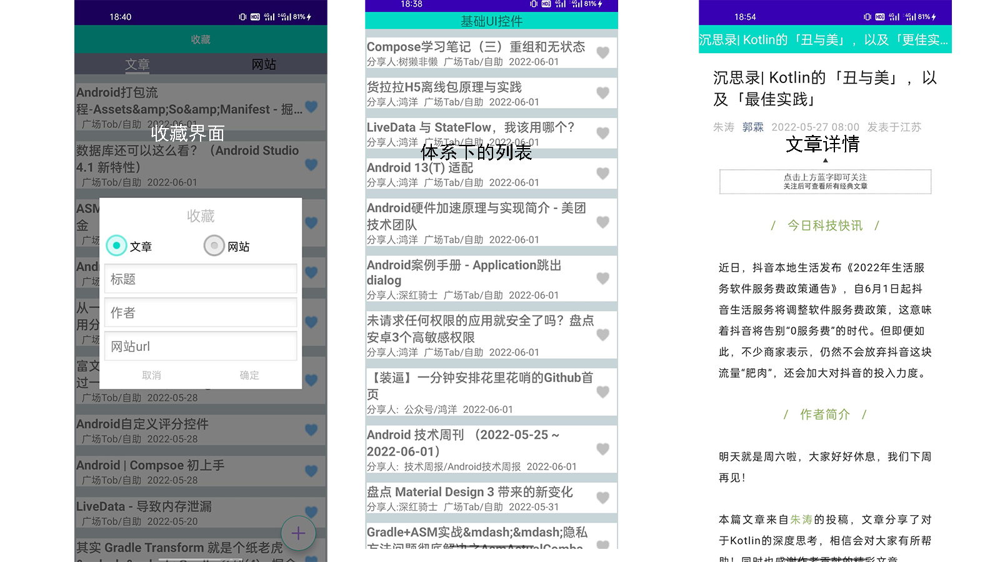

# Wanandroid
### 使用知识：

MVP+Retrofit+自定义View...

刷新框架：[SmartRefreshLayout](https://github.com/scwang90/SmartRefreshLayout)

网络请求框架：[Retrofit](https://github.com/square/retrofit)、[okhttp](https://github.com/square/okhttp)

ui注入框架：[ButterKnife](https://github.com/JakeWharton/butterknife)

图片加载框架:[Glide](https://github.com/bumptech/glide)

异步请求:Handler

### 主界面

### 用户相关

### 内容相关

